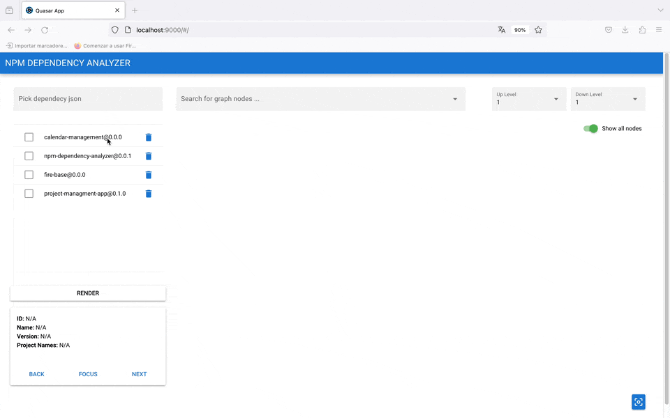
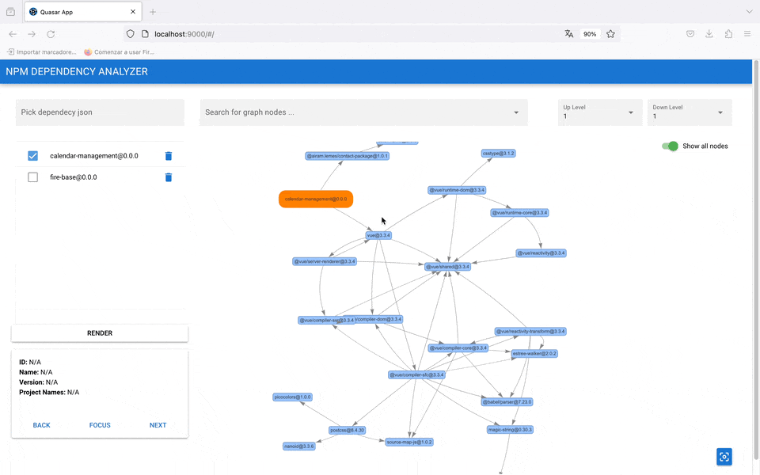
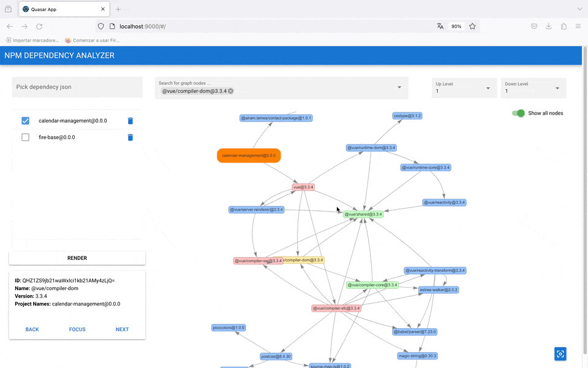

# NPM DEPENDENCY ANALYZER


## Overview

NPM Dependency Analyzer is a tool designed to analyse and visualise the dependencies of your Node.js project.

It provides information about the dependency tree of the project, making it easier to understand and manage the dependencies of your project.
#
<p align="center">
  
</p>


### Featured Functionalities

- ##### 1. Dependency Search:
  Use the search bar to find and explore the dependencies available in your project.


- ##### 2. Dependency Analysis:
    Set the depth dimension to view the dependencies that are used by a specific dependency. You can also identify the dependencies on which it depends directly or indirectly.

-  ##### 3. Multi-Project Rendering:
      Analyse and compare dependencies between multiple projects simultaneously for more complete and efficient management.

-  ##### 4. Search Node Centric Toogle:
      Use the toogle to focus only on nodes related to the current search, improving clarity and focus during analysis.

-  ##### 5. Dependency Colouring:
      Dependencies are highlighted with colours for easier understanding and visual analysis, providing a clear graphical representation of the relationships between elements.

-  ##### 6. Detailed Node Information:
    When searching for nodes, access a section that provides general information on the selected node, facilitating more detailed analysis and the ability to focus on specific nodes as needed.


These combined functionalities offer a complete and efficient experience to explore, analyse and understand dependencies in your projects, improving the management and decision making related to project dependencies.


#
## Getting started

### Install the dependencies
```bash
npm install
# You can install quasar globally or skip this step
npm install -g @quasar/cli
```

### Start the app in development mode (hot-code reloading, error reporting, etc.)
```bash
quasar dev # Using quasar cli
npm run dev # Using npm
```


### (Optional) Build the app for production
```bash
quasar build
```
#

## How to use it

- ##### 1. Generate the dependency files:
  You can use the json of your project, but it only has the first level dependencies.
  ###
  Inside of your project folder, run the following command to get a json file with all the dependencies of your project.
  ###
  ```bash
  npm ls --all --json > /path.json
  ```
  ##

- ##### 2. Load dependency and render:
  #
  <p align="center">
    
  </p>

  #


- ##### 3. Search for nodes:
  #
  <p align="center">
    
  </p>

  #
  <p align="center">Orange nodes are the initial nodes of each project. You can also click on a node !</p>

  #

- ##### 4. Changing depth level:
  #
  <p align="center">
    
  </p>

  #

  <p align="center">All selected nodes will be coloured in yellow, the up levels in red tones and the down levels in green tones.</p>

  #

- ##### 5. Using node information:
  #
  <p align="center">
  
  </p>

  #

  <p align="center">The selected nodes will be deleted after each rendering, so their information will not be displayed either.</p>

  #

###


### Enjoy !!

